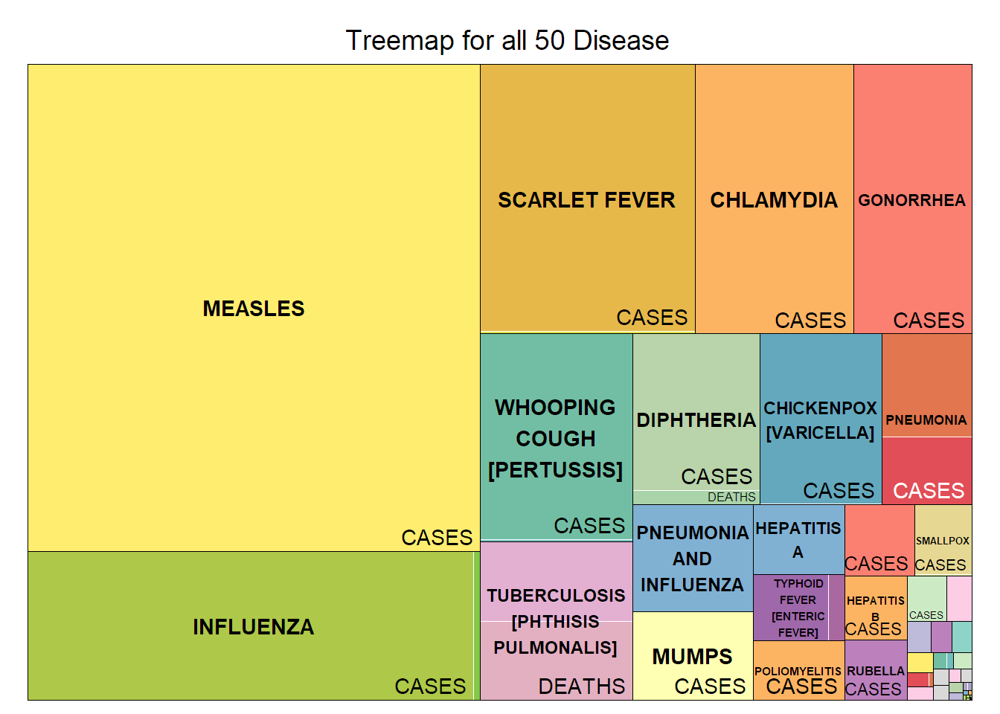

# Tycho2.0

## Data Visualisation 

### Medical Data From U.S. health Department

This project is aiming to analyse massive data that contains the details of 50 diseases that occurred in all states of the U.S during the time 1888 to 2014. The Source of this data is from Project Tycho which works with national and global health institutes and researchers to make data easier to use and free to access for public to do analysis and research.

R provides quick and simple tools that make it easier to transform data into visually insightful pieces like graphs. The data gets easier to read and comprehend from the graphs. The following is a list of the various types of graphs are plotted here using Descriptive statistics and ggplot2.

- Tree map
    - 
- Scatter Plot
- Geom map
- Bar Plot
- Heat map
- Box Plot
- Animation Plot

